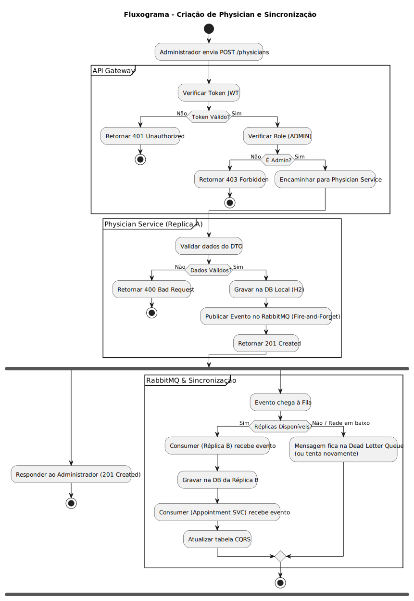

# Documento Arquitetoral (Projeto SIDIS 2ª Iteração)

Com este documento é pretendido demonstrar os diagramas criados e explicar de forma resumida o funcionamento do projeto.

## Vista Física

### Vista Física Nível 1

Com este diagrama pretende-se representar a comunicação entre os diferentes componentes.

- Todo o tráfego do cliente é roteado através de um Nginx Reverse Proxy, que o encaminha para o API Gateway.
- O Gateway é o ponto de controlo que valida o JWT e direciona as requisições para os serviços do sistema (Physician, Patient, Appointment), garantindo a autenticação em nível de edge.
- O sistema utiliza o RabbitMQ Message Broker como o coração da comunicação assíncrona. Os serviços de origem (Physician Service e Patient Service) publicam os seus eventos de alteração de dados no RabbitMQ.
- O Appointment Service funciona como um Consumidor de Dados (CQRS), lendo os eventos do RabbitMQ para manter a sua cópia local (Read Model) dos dados de Patient e Physician sincronizada. Os três serviços (incluindo o appointmentService) também publicam os seus próprios eventos, sugerindo um vasto uso de notificações assíncronas em toda a plataforma.

### Vista Física Nível 1 (Discovery Server)

O diagrama(VF1) ilustra o papel central do Discovery Server (Netflix Eureka) na arquitetura de microserviços.

- O Discovery Server (Netflix Eureka) atua como o componente central da plataforma. Todos os microserviços de negócio e infraestrutura (Auth Service, Appointment, Physician, Patient) registam-se ativamente (Registers) no Eureka, permitindo que o servidor saiba quais instâncias estão ativas e onde encontrá-las.
- O API Gateway não só se regista no Eureka, mas também o consulta ativamente (Discovers). Isto permite que o Gateway obtenha a localização (endereço e porta) atualizada de qualquer serviço de backend em tempo real, roteando as requisições de forma dinâmica e resistente a falhas.
- Toda a comunicação entre os serviços e o Discovery Server, tanto para registro (Registers) quanto para consulta (Discovers), é realizada através de requisições HTTP. Isto é a espinha dorsal de como os microserviços se encontram e interagem dentro da plataforma sem terem de ter endereços fixos e pré-configurados.

### Vista Física Nível 2

Com este diagrama pretende-se representar a comunicação dos diferentes serviços com a API Gateway, o NGinx e o RabbitMQ como também a relação do Controller destes serviços com a própria base de dados.

- O sistema utiliza um Nginx Reverse Proxy como ponto de entrada para encaminhar todo o tráfego externo para o API Gateway. O Gateway é o ponto central de roteamento, responsável por direcionar as requisições HTTP tanto para o Auth Service (para autenticação) quanto para os três serviços de negócio (Patient, Physician e Appointment).
- O RabbitMQ Message Broker é um nó de deployment dedicado que gerencia a comunicação assíncrona. Todos os serviços de negócio (Appointment, Patient, Physician) interagem com o RabbitMQ, indicando que todos eles publicam e consomem eventos (CREATE/UPDATE/DELETE), suportando padrões como CQRS e Event Sourcing em toda a plataforma.
- Cada serviço e o serviço de autenticação estão mapeados para o seu próprio ambiente (Deployment Node) e cada um possui a sua base de dados local (H2 para os serviços de negócio e PostgreSQL para o Auth Service). Isto reflete o princípio dos microsserviços de possuir os seus próprios dados e isolar falhas, sendo o H2 típico em ambientes de desenvolvimento/teste.

### Vista Física Nível 3

Com este diagrama pretende-se representar as comunicações realizadas quando estão a correr várias instancias de cada serviço.

- Todos os serviços de negócio (Appointment, Patient, Physician) estão configurados como Clusters com múltiplas réplicas (Replica A e Replica B). O tráfego externo é distribuído pelo Nginx para o API Gateway, que, por sua vez, é responsável pelo Load Balancing das requisições HTTP entre as diferentes instâncias de cada serviço.
- O RabbitMQ Message Broker é usado para garantir a consistência dos dados em toda a plataforma. Cada réplica de cada serviço (A e B) atua como um Publicador de Eventos (Pub Event) e um Consumidor de Eventos (Sync (Consome)), sugerindo que os eventos de alteração de dados são usados para sincronizar o estado entre as instâncias e potencialmente suportar o padrão CQRS.
- Cada réplica de serviço (por exemplo, Appointment SVC A) possui a sua própria base de dados local (H2 File). Isto implica que o serviço é autónomo e que a sincronização e a garantia da consistência dos dados entre as réplicas dependem inteiramente do fluxo de eventos AMQP através do RabbitMQ (mecanismo de Eventual Consistency).

## C4

### C1 - Context View

Com este diagrama pretende-se representar a interação das diferentes entidades com o sistema.

- O Patient pode visualizar os próprios Appointments e cancelá-los ou alterá-los. Este também pode pesquisar Physicians.
- O Physician pode ver e criar Appointments.
- O Administrator pode registar e alterar todos os dados existentes no serviço.

### C2 - Component View

Este diagrama C4 apresenta a arquitetura completa da plataforma HAP, detalhando as interações entre todos os serviços, infraestrutura e utilizadores.

- O acesso do utilizador (Physician, Patient, Admin) é roteado pelo Nginx Reverse Proxy para o API Gateway. O Gateway atua como ponto de controle central, roteando requisições de autenticação para o Auth Service (que gera o JWT) e, em seguida, encaminhando todas as requisições de negócio para os serviços respetivos (Physician, Patient, Appointment) com o Token JWT anexado, garantindo a validação da segurança.
- O RabbitMQ Message Broker gerencia a comunicação assíncrona. Todos os serviços de negócio (Physician, Patient, Appointment) publicam eventos após alterações. O Appointment Service, em particular, é designado como um consumidor de CQRS (Syncs Data (CQRS)), indicando que ele consome eventos de outros serviços (Patient e Physician) para manter a sua cópia de dados locais para validação.
- Todos os serviços de backend registam-se no Discovery Server (Eureka), permitindo que o API Gateway os descubra dinamicamente para roteamento. Além disso, cada serviço possui a sua própria base de dados isolada (PatientsDB, PhysiciansDB, AppointmentsDB), reforçando o princípio de que cada microsserviço detém e gere os seus próprios dados mestre.

### C3 - Component View

O diagrama de componentes C3 detalha a estrutura interna do Appointment Service e demonstra a implementação clara de arquiteturas em camadas, CQRS (Command Query Responsibility Segregation) e comunicação Event-Driven.

- O serviço é rigidamente organizado em camadas (Web Layer, Business Layer, Messaging Layer, Data Access Layer). As requisições externas chegam através do API Gateway, passam pelo componente SecurityConfig para autorização (provavelmente JWT) e chegam ao AppointmentController, garantindo que a lógica de segurança é aplicada antes do acesso à lógica de negócio.
- O serviço tem uma camada de mensagens dedicada com um AppointmentProducer (para enviar eventos de agendamento) e um DataSyncConsumer (para receber dados externos, via RabbitMQ). O Business Layer utiliza os Ext*Repository (os Read Models CQRS) para validar a existência de médicos e pacientes internamente, em vez de fazer chamadas HTTP síncronas.
- A camada de acesso a dados interage com uma única H2 Database local. Esta base de dados armazena os dados do serviço (através do AppointmentRepository) e também armazena as réplicas dos dados externos (ExtPhysicianRepository e ExtPatientRepository), que são atualizadas de forma assíncrona pelo DataSyncConsumer (o listener do RabbitMQ).

## Fluxograma

Para complementar a vista funcional, apresentamos o fluxo detalhado de execução para operações de escrita. Este diagrama demonstra o tratamento do pedido desde a entrada no API Gateway (validações de segurança) até à persistência na base de dados local.

## AuthService- Novo serviço 
Para esta iteração e após debate interno, a equipa de desenvolvimento decidiu incluir um quarto serviço neste caso de autenticação para facilitar esta ação, aqui cada utilizador tem a sua role atribuída (neste caso as roles existentes são Admin, Physician e Patient). Com esta separação o nível de segurança aumenta pois definimos o nível de acesso a informação que cada role tem, isto é por exemplo apenas admin e physician podem visualizar dados de outros pacientes, registos de consultas, entre outros. Informação sensível armazenada de forma mais segura

## JWT
A utilização de JWT (JSON Web Tokens) no nosso projeto permite garantir um mecanismo de autenticação e autorização seguro, eficiente e totalmente desacoplado entre serviços. Como se trata de uma arquitetura baseada em microserviços, é essencial evitar dependências constantes ao Auth Service; o JWT resolve este problema ao encapsular de forma segura a identidade do utilizador, bem como as suas permissões, num token assinado digitalmente.
Desta forma, cada serviço consegue validar autonomamente o token recebido — sem necessidade de chamadas adicionais — assegurando que apenas pedidos autenticados e autorizados são processados. Isto reduz latência, melhora a escalabilidade e evita pontos únicos de falha. Além disso, o JWT suporta mecanismos de expiração e revogação, permitindo reforçar a segurança contra acessos indevidos e reutilização de tokens expirados.
Assim, o uso de JWT no projeto contribui para uma comunicação mais rápida, segura e consistente entre os diferentes serviços que compõem a solução.

## NGinx
A utilização do Nginx no nosso projeto justifica-se pela necessidade de um ponto de entrada central capaz de gerir o tráfego externo de forma eficiente e segura. O Nginx funciona como um reverse proxy à frente do API Gateway, o que permite distribuir requisições, aplicar regras de routing e melhorar o desempenho através de caching e otimizações internas. Além disso, o Nginx oferece suporte nativo para load balancing, TLS/HTTPS, rate limiting e proteção contra acessos indevidos, o que garante maior robustez à arquitetura. A sua elevada performance, baixa utilização de recursos tornam-no uma solução ideal para ambientes com múltiplos microserviços, como o presente projeto.

## PostgresSQL 
A utilização de PostgreSQL no serviço de autorização justifica-se pela sua fiabilidade e segurança, essenciais para garantir a integridade de credenciais e permissões. É um sistema robusto, com boa performance em operações de autenticação e totalmente open-source, tornando-o adequado para armazenar dados sensíveis do Auth Service.

### Outras Informações 

## NGinx Config (nginx.conf)

    worker_processes  1;

    events {
    worker_connections  1024;
    }

    http {
    include       mime.types;
    default_type  application/octet-stream;
    sendfile        on;
    keepalive_timeout  65;

    # --- DEFINIR GATEWAYS ---
    upstream spring_gateways {
        server 127.0.0.1:8089;
        server 127.0.0.1:8090;
    }

    server {
        # Porta padrão (80)
        listen       80;
        server_name  localhost;

        location / {
            proxy_pass http://spring_gateways/;

            proxy_set_header Host $host;
            proxy_set_header X-Real-IP $remote_addr;
            proxy_set_header X-Forwarded-For $proxy_add_x_forwarded_for;
        }
    }