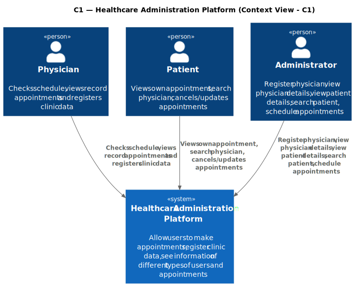
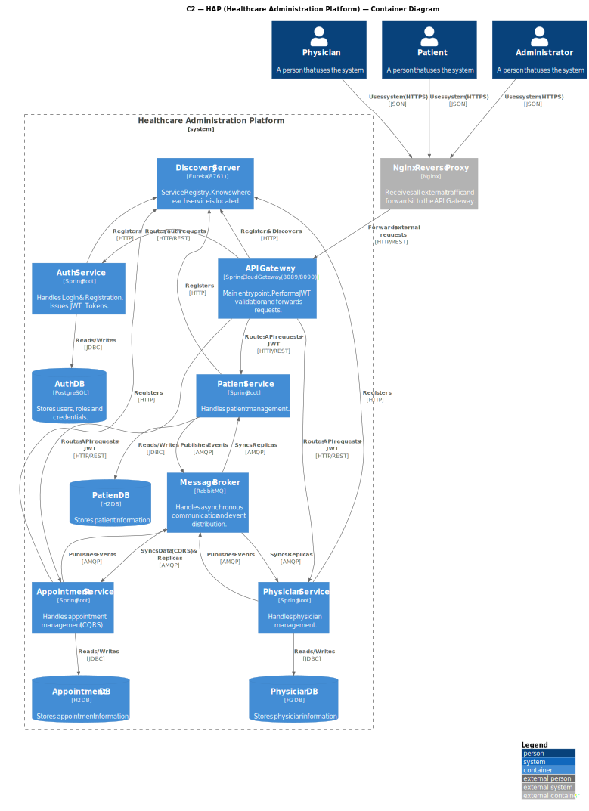
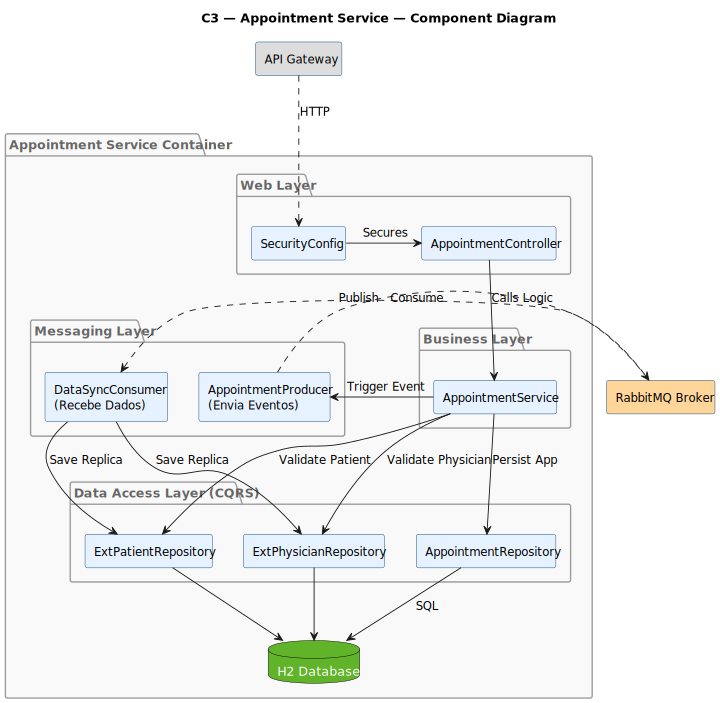

# Documento Arquitetoral (Projeto SIDIS 2ª Iteração)

Com este documento é pretendido demonstrar os diagramas criados e explicar de forma resumida o funcionamento do projeto.

## Vista Física

### Vista Física Nível 1

Com este diagrama pretende-se representar a comunicação entre os diferentes componentes.

- O AppointmentService é o único componente capaz de comunicar com outro tipo de componentes diferentes.
- Caso algum dado relacionado com Patients ou Physicians seja adicionado no AppointmentService, este irá verificar se estes já existem nas databases dos respetivos serviços.
- Caso não existam, serão realizados pedidos HTTP/REST POST para manter a coerencia dos dados.

### Vista Física Nível 2

Com este diagrama pretende-se representar a comunicação dos diferentes serviços com a API Gateway como também a relação do Controller destes serviços com a própria base de dados.

- Quando ocorrer um pedido HTTP/REST entre componentes, este pedido será direcionado à API Gateway.
- Cada Serviço terá o seu Controller que será capaz de modificar a própria base de dados.
- Antes de qualquer ação irá ser necessário fazer a autenticação

### Vista Física Nível 3

Com este diagrama pretende-se representar as comunicações realizadas quando estão a correr várias instancias de cada serviço.

- Sempre que se realizar um pedido HTTP/REST em qualquer instância de qualquer componente, esse pedido será encaminhado à API Gateway.
- A API Gateway é responsável por enviar os pedidos às diferentes réplicas.
- Assim é mantida a coerencia de dados entre as diferentes instâncias.

## C4

### C1 - Context View

Com este diagrama pretende-se representar a interação das diferentes entidades com o sistema.

- O Patient pode visualizar os próprios Appointments e cancelá-los ou alterá-los. Este também pode pesquisar Physicians.
- O Physician pode ver e criar Appointments.
- O Administrator pode registar e alterar todos os dados existentes no serviço.

### C2 - Component View

Com este diagrama pretende-se representar o fluxo de pedidos das diferentes entidades até à alteração das bases de dados.

- Cada entidade comunica com o respetivo serviço (administrator pode comunicar com qualquer serviço).
- Os serviços estão ligados à API Gateway e ao Discovery Server para facilitar a comunicação entre os mesmos.
- Cada serviço está também ligado à própria base de dados para guardar informações pretendidas.

### C3 - Component View

Com este diagrama pretende-se detalhar os componentes internos do contentor appointment-service. Este serviço é o mais 
complexo do sistema, pois além de gerir os seus próprios dados, é responsável por orquestrar validações com outros serviços 
e agregar dados de outras réplicas de si mesmo (num modelo P2P).

## AuthService- Novo serviço 
Para esta iteração e após debate interno, a equipa de desenvolvimento decidiu incluir um quarto serviço neste caso de autenticação para facilitar esta ação, aqui cada utilizador tem a sua role atribuída (neste caso as roles existentes são Admin, Physician e Patient). Com esta separação o nível de segurança aumenta pois definimos o nível de acesso a informação que cada role tem, isto é por exemplo apenas admin e physician podem visualizar dados de outros pacientes, registos de consultas, entre outros. Informação sensível armazenada de forma mais segura

## JWT
A utilização de JWT (JSON Web Tokens) no projeto permite garantir um mecanismo de autenticação e autorização seguro, eficiente e totalmente desacoplado entre serviços. Como se trata de uma arquitetura baseada em microserviços, é essencial evitar dependências constantes ao Auth Service; o JWT resolve este problema ao encapsular de forma segura a identidade do utilizador, bem como as suas permissões, num token assinado digitalmente.
Desta forma, cada serviço consegue validar autonomamente o token recebido — sem necessidade de chamadas adicionais — assegurando que apenas pedidos autenticados e autorizados são processados. Isto reduz latência, melhora a escalabilidade e evita pontos únicos de falha. Além disso, o JWT suporta mecanismos de expiração e revogação, permitindo reforçar a segurança contra acessos indevidos e reutilização de tokens expirados.
Assim, o uso de JWT no projeto contribui para uma comunicação mais rápida, segura e consistente entre os diferentes serviços que compõem a solução.

